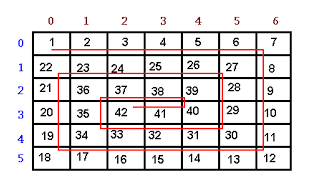
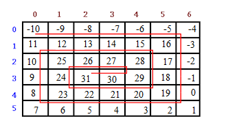

## Snake array task

### Create a function that that takes number(it can be any number) as an argument and produce a spiral matrix (two-dimensional array) with 6 columns and 5 rows, where the start is the number you pass. See images below for the pattern. In the first example snakeArray(1) was called. The second one snakeArray(-10).

 

